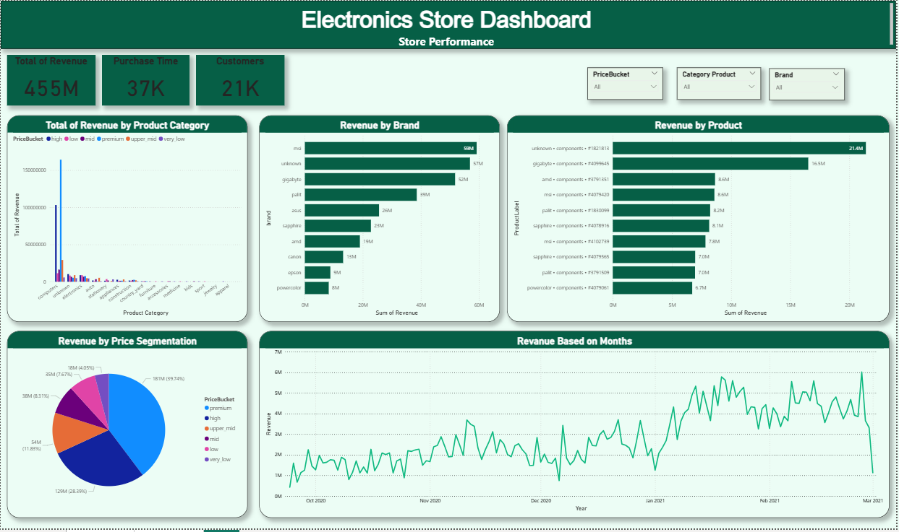

# 📦 Electronics Store Performance Analytics

**Project Description**  
Analisis end-to-end kinerja penjualan dan perilaku pelanggan pada dataset e-commerce (electronics, **885K+ events**). Hasil utama berupa **dashboard Power BI** (Performance & Customer Behavior) untuk mengungkap driver revenue, pola konversi, dan waktu pembelian terbaik.

---

## 📊 Key Steps (ringkas)
- **Data Understanding & Cleaning:** standarisasi brand/kategori, tangani missing (label **"unknown"**), cek outlier; parsing waktu & pembuatan DimDate.  
- **Feature Engineering:** hierarchy kategori (`category_l1–l3`), flag event (view/cart/purchase), fitur waktu (dow, hour, weekend), **price bucket** (6 level).  
- **Exploratory Analysis & BI:** revenue by brand/kategori/price, **MoM**, **AOV Session**, **CVR**, **heatmap waktu**; dashboard interaktif untuk filter lintas segmen.

---

## 📈 Results (highlights)
- **Scale:** 455M revenue · 37K purchase events · 21K customers.  
- **Drivers:** revenue terkonsentrasi di **components & computers**; price mix didominasi **premium/high (~68%)**.  
- **Brands:** **MSI** & **Gigabyte** memimpin (CVR ± **9%** & **7.6%**).  
- **Funnel:** bottleneck terbesar **view → cart** (≈6% ke cart; ≈4.2% purchase).  
- **AOV Session:** tertinggi **computers (~30K)**; mayoritas kategori lain **< 7K**.  
- **Peak time:** checkout **weekday 17:00–21:00** (terutama Selasa–Rabu).

---

## 🧭 Business Recommendations
- Jalankan kampanye & reminder pada **weekday 17:00–21:00**.  
- Prioritaskan **stok & exposure Top-SKU** untuk **components/computers** serta brand **MSI/Gigabyte**.  
- Naikkan **View→Cart**: perbaiki CTA/listing, rekomendasi dinamis, retargeting viewer.  
- Naikkan **Cart→Purchase**: **free-shipping threshold**, kupon kecil bertenggat, reminder cart.  
- Rapikan data **brand "unknown"** untuk atribusi yang akurat.

---

## 🚀 Tech Stack
- **Python:** pandas, numpy, jupyter, matplotlib/plotly  
- **BI:** Power BI (DAX)  
- **Data:** *eCommerce events history – electronics* (885K+ rows; 9 columns)

---

## 📸 Preview

## 🔗 Files
- `Dashboard/electronics_analytics.pbix` – Power BI report  
- `Dataset/ecommerce_eda.csv` – dataset terproses

> Kontak/Link: [GitHub Profile](#) · [LinkedIn](#)
